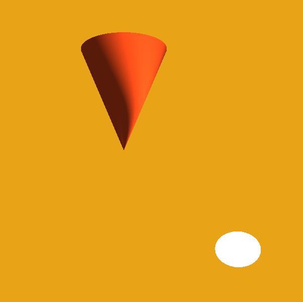

# ToyGFX

## 3D Primitives

| Solid |  Wireframe |
|---|---|
|   |  |

## Instanced Indexed Rendering

| 3348000 quads |  cool spiral |
|---|---|
|   |  |

## Point Light 

| Flat Shading |  Smooth Shading |
|---|---|
|   |  |

## Texture and Normal mapping

